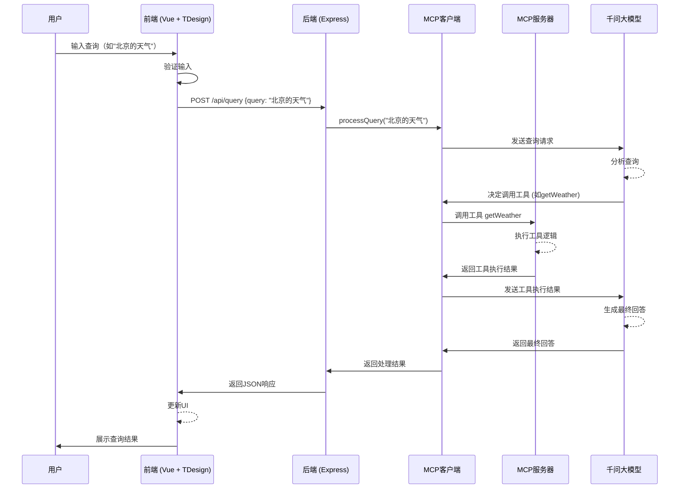

# TapdAnalyser

基于 Monorepo 架构的全栈应用，使用 Vue3 + Express + 千问大模型，实现智能文档分析和查询功能。

## 主要功能
 
- 基于MCP协议使用千问大模型分析文本查询并返回结果
- 基于MCP server使用大模型分析md文件产品需求按要求转配置代码（开发中）
- 传入TAPD链接能自动根据产品要求转配置代码（计划中，需要解决内网访问安全问题）

## 技术栈

- 包管理：pnpm + workspace
- 构建工具：Turborepo
- 前端：Vue3 + TypeScript + Vite + TDesign-Vue-Next
- 后端：Express + TypeScript + MCP协议
- 大模型：通义千问（qwen-plus）
- 共享包：TypeScript

## 项目结构

```
tapdAnalyser/
├── apps/
│   ├── frontend/     # Vue3 前端应用
│   │   └── src/
│   │       ├── components/  # 组件目录
│   │       │   └── QueryInput.vue  # 查询输入组件
│   │       ├── App.vue      # 主应用组件
│   │       └── main.ts      # 入口文件
│   └── backend/      # Express 后端应用
│       └── src/
│           ├── api/        # API接口
│           │   └── index.ts  # Express服务器
│           ├── client/     # MCP客户端
│           │   └── mcpClient.ts  # MCP客户端实现
│           ├── server/     # MCP服务器
│           │   └── index.ts  # MCP服务器实现
│           └── index.ts    # 后端入口文件
├── packages/
│   └── shared/       # 共享类型和工具
├── package.json
├── pnpm-workspace.yaml
└── turbo.json
```

## 开发指南

### 环境要求

- Node.js 18+
- pnpm 8+

### 安装依赖

```bash
pnpm install
```

### 环境配置

在`apps/backend`目录下创建`.env`文件：

```env
# 通义千问的apiKey
OPENAI_API_KEY=your_api_key

# qwen-plus的baseURL
OPENAI_BASE_URL=https://dashscope.aliyuncs.com/compatible-mode/v1

# 端口
PORT=3003
```

### 开发模式

```bash
# 同时启动前端和后端
pnpm dev:all

# 只启动前端
pnpm dev:frontend

# 只启动后端
pnpm dev:backend
```

### 构建

```bash
# 构建所有项目
pnpm build

# 构建前端
pnpm build:frontend

# 构建后端
pnpm build:backend
```

### 生产环境运行

```bash
# 同时启动前端和后端
pnpm start:all

# 只启动前端
pnpm start:frontend

# 只启动后端
pnpm start:backend
```

### 代码检查

```bash
pnpm lint
```

## 项目架构

### 前后端交互流程



## API接口

### 查询接口

- **URL**: `/api/query`
- **方法**: POST
- **请求体**:
  ```json
  {
    "query": "要查询的内容"
  }
  ```
- **响应**:
  ```json
  {
    "result": "查询结果"
  }
  ```

### 健康检查接口

- **URL**: `/api/health`
- **方法**: GET
- **响应**:
  ```json
  {
    "status": "ok",
    "message": "服务正常运行"
  }
  ```

## 后续计划

1. 实现MD文件上传和分析功能
2. 实现分析结果导出功能
3. 集成TAPD API，支持直接从TAPD获取需求文档
4. 优化UI体验和响应速度

## 贡献指南

欢迎提交Issue和Pull Request！

## 许可证

MIT 